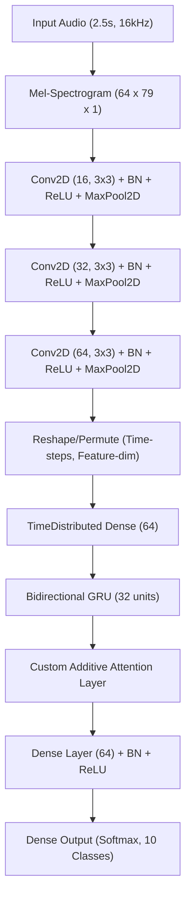

# Voice-Controlled PC Automation System (NOVA)
*Using Small Vocabulary Speech Recognition (CRNN + Attention)*

An end-to-end speech processing project featuring a lightweight deep learning architecture for small-vocabulary spoken command recognition. It includes a custom modern desktop dashboard interface built with CustomTkinter that runs as a background process, listens for the wake word **"Nova"**, overlays a command recognition prompt, and automates common PC tasks (volume adjustments, application launches, active window closures) based on spoken command signals.

---

## 🚀 Key Features

* **Wake Word Activation**: Listens continuously for the wake word **"Nova"** to activate the assistant overlays.
* **Modern GUI Dashboard**: Sleek dark-themed interface built using `CustomTkinter` displaying live activity logs, system state transitions, and a clean control toggle.
* **Automated System Control**: Programmatic system operations including volume controls, opening browser/IDE/Task Manager, closing window shortcuts, and secure shutdown handler.
* **Lightweight Hybrid Deep Learning**: Consists of Convolutional blocks (spatial feature maps) linked to a Bidirectional GRU (temporal patterns) capped with a custom Attention mechanism, packing only **~80,000 parameters** to optimize execution and prevent overfitting on small datasets.
* **Custom Data Pipeline**: Complete workflow tooling for dataset consistency checks, in-place resampling, on-the-fly SpecAugment data augmentation, and model evaluation metrics.

---

## 🎙️ Spoken Command Vocabulary

The system classifies audio inputs into one of the **10 vocabulary classes**:

| Command Class | Automated PC Action | Trigger Mechanism |
| :--- | :--- | :--- |
| **`Nova`** | Wake word: Activates command receiver overlay | Wake threshold activation |
| **`Open_Chrome`** | Launches Google Chrome Browser | `subprocess.Popen("start chrome")` |
| **`Open_Visual_Studio_Code`** | Opens VS Code editor | `subprocess.Popen("code")` |
| **`Open_Task_Manager`** | Launches Windows Task Manager | `subprocess.Popen("taskmgr.exe")` |
| **`Close_Window`** | Closes the active window | Simulates `Alt + F4` shortcut |
| **`Increase_Volume`** | Raises master system volume by +10% | Windows Core Audio APIs (`pycaw`) |
| **`Reduce_Volume`** | Lowers master system volume by -10% | Windows Core Audio APIs (`pycaw`) |
| **`Mute_Volume`** | Toggles system sound mute state | Windows Core Audio APIs (`pycaw`) |
| **`Shut_Down_System`** | Shuts down the PC (disabled by default for safety) | Windows Shutdown Command |
| **`Background`** | Noise/Silence filter (no action executed) | Null Class |

---

## 📐 Model Architecture

The Speech recognition engine is powered by a **Convolutional Recurrent Neural Network (CRNN) with Attention**:



### Regularization and Anti-Overfitting Safeguards:
* **SpecAugment**: Frequency and Time masking applied on-the-fly during training batches.
* **Regularization**: L2 weight decay ($10^{-4}$) added on dense and recurrent weights.
* **Dropout**: Dense, convolutional, and recurrent layers utilize dropout probabilities ranging from 0.2 to 0.5.
* **Label Smoothing**: Softmax outputs use a smoothing factor of `0.1` to enhance generalizability.

---

## 📁 Repository Structure

```markdown
├── Audio Dataset/          # Dataset structure containing wav audio samples
│   └── Male/User 1/
│       ├── Original/       # Original recorded audio files
│       └── Augmented/      # Augmented voice recordings
├── crnn_model.py           # Model definitions, dataset generators, and main training routines
├── voice_service.py        # Core microphone recording & prediction service (PyAudio + Librosa + Keras)
├── nova_app.py             # Desktop graphical user interface (CustomTkinter)
├── live_recognition.py     # Command-line interface for interactive real-time mic testing
├── feature_extraction.py   # Extracts normalized mel spectrograms and builds train/val/test splits
├── evaluate_model.py       # Loads speech_crnn.keras to run evaluations on the test subset
├── resample_fix.py         # Diagnostic utility to resample non-16kHz WAV samples to 16kHz in-place
├── check_consistency.py    # Audits dataset properties (sample rate, bit depth, channel count)
├── speech_crnn.keras       # The trained TensorFlow Keras model containing optimal weights
├── processed_data.npz      # Compiled dataset arrays (X_train, y_train, etc.) in compressed format
├── confusion_matrix.png    # Evaluation results represented as a heatmap matrix
├── learning_curves.png     # Plot logs tracking model loss and accuracy across training epochs
└── .gitignore              # Configured to exclude system and compilation files
```

---

## 🛠️ Installation & Setup

### Prerequisites
Make sure your system has python 3.9+ and Git installed. A microphone is required for real-time speech interaction.

1. **Clone the repository**:
   ```bash
   git clone https://github.com/Kishorens17/Voice-controlled-pc-automation-system-using-small-vocabulary-speech-recognition.git
   cd Voice-controlled-pc-automation-system-using-small-vocabulary-speech-recognition
   ```

2. **Install dependencies**:
   ```bash
   pip install numpy tensorflow librosa pyaudio soundfile pyautogui pycaw comtypes scikit-learn matplotlib customtkinter
   ```

   > [!NOTE]
   > On Windows, if installing `pyaudio` fails, you can download the appropriate pre-compiled wheel from [Unofficial Windows Binaries for Python Extension Packages](https://www.lfd.uci.edu/~gohlke/pythonlibs/#pyaudio) or install it via `pip install pipwin` followed by `pipwin install pyaudio`.

---

## 🎮 How to Use

### 1. Launching the GUI Dashboard (Recommended)
Run the desktop dashboard:
```bash
python nova_app.py
```
* Click the **"START SERVICE"** button. The indicator changes to green, and the engine enters background listening mode.
* Say **"Nova"** clearly into the microphone.
* An interactive popup overlay appears displaying *"Nova here! How can I help you?"*.
* Speak any of the control commands (e.g., *"Open Chrome"*, *"Increase Volume"*) within a 2.5-second window to execute the automation action.

### 2. Command Line Live Testing
Test prediction confidences directly inside your terminal:
```bash
python live_recognition.py
```
* The terminal will list the target classes and wait.
* Press `ENTER` and speak your command.
* The script displays the classification prediction with probability scores and the top-3 candidate commands.

---

## 📊 Performance & Evaluation

The training process produces detailed diagnostics:

* **Confusion Matrix (`confusion_matrix.png`)**: Visually assesses classification performance across all 10 command categories to diagnose word confusion.
* **Learning Curves (`learning_curves.png`)**: Tracks validation/training loss and accuracy to monitor regularization performance over epochs.
* **Evaluation (`evaluate_model.py`)**:
  ```bash
  python evaluate_model.py
  ```
  Runs evaluation metrics on test partition files and outputs loss, overall accuracy, precision, recall, and f1-score per class.

---

## 🔒 Safety and Limitations
* **Safety Hold**: The `Shut_Down_System` trigger code is commented out in `voice_service.py` and `live_recognition.py` to prevent unintentional power downs during testing. You can uncomment the `shutdown` command in those files to enable it.
* **Single User Focus**: The model is highly optimized for the current user voice patterns and characteristics present in the dataset directory.
